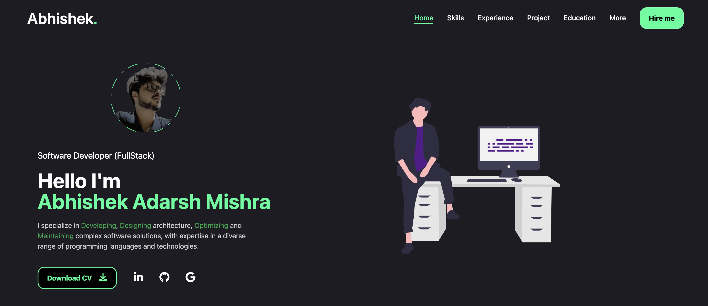

# My Portfolio Website

Welcome to my portfolio website! This project showcases my skills, projects, and experience as a [your role, e.g., Software Engineer, Full Stack Developer, etc.]. Built using modern web technologies, this website is fast, responsive, and provides a seamless user experience.

## 🌟 Features

- **Responsive Design**: Optimized for all devices, from desktops to smartphones.  
- **Showcase Projects**: A dedicated section to highlight my key projects with detailed descriptions and links. 
- **Showcase Experience**: A dedicated section to highlight my work Expreience with detailed descriptions and links. 
- **Interactive UI**: Engaging and user-friendly interface.  
- **Performance**: Built with Vite for blazing-fast development and optimized production builds.  
- **Styling**: Designed with Tailwind CSS for a sleek and modern look.  

## 🛠️ Built With

- **React**: A JavaScript library for building user interfaces.  
- **Vite**: A fast build tool and development server.  
- **Tailwind CSS**: A utility-first CSS framework.  

## 🚀 Live Demo

You can check out the live demo of my portfolio [https://abhishekresume-a6620.web.app/].

## 📂 Folder Structure

```
root
├── src
│   ├── components    # Reusable components
│   │   ├── pages     # Page components
│   │   ├── ui        # UI components
│   ├── assets        # Static assets (images, fonts, etc.)
│   ├── routes        # Ruotes configuration
│   ├── shared        # Shared files like models etc
│   ├── utils         # utility files
│   └── index.ts      # Global and custom Tailwind CSS configurations
├── public            # Public assets
├── .gitignore        # Ignored files
├── package.json      # Project metadata and dependencies
├── tailwind.config.js # Tailwind CSS configuration
└── vite.config.js    # Vite configuration
```

## ⚙️ Installation

Follow these steps to run the project locally:

1. **Clone the repository**:  
   ```bash
   git clone https://github.com/AbhishekAdarshMishra/my-portfolio
   ```

2. **Navigate to the project directory**:  
   ```bash
   cd my-portfolio
   ```

3. **Install dependencies**:  
   ```bash
   npm install
   ```

4. **Start the development server**:  
   ```bash
   npm run dev
   ```

5. Open your browser and navigate to `http://localhost:5173/`.

## 📝 Scripts

- `npm run dev`: Starts the development server.  
- `npm run build`: Builds the app for production.  
- `npm run preview`: Previews the production build.  

## 📸 Screenshots



## 🤝 Contributing

Contributions, issues, and feature requests are welcome! Feel free to check the [issues page](https://github.com/AbhishekAdarshMishra/my-portfolio/issues).  

## 📄 License

This project is licensed under the [MIT License](LICENSE).  

## ✨ Contact

Feel free to reach out to me for collaboration or feedback:  
- **Portfolio**: [Portfolio Link](https://abhishekresume-a6620.web.app/)  
- **Email**: [Email Address](mailto:abhishekmshr063@gmail.com)  
- **GitHub**: [GitHub Profile](https://github.com/AbhishekAdarshMishra)  
- **LinkedIn**: [LinkedIn Profile](https://www.linkedin.com/in/abhishek-adarsh-mishra-445125165/)  